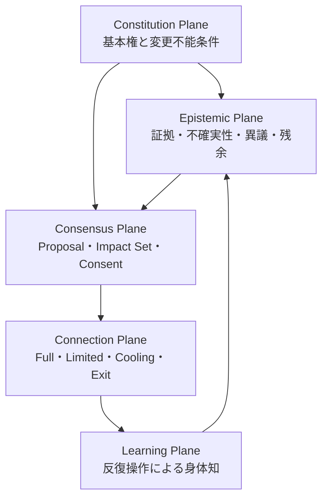

# Epistemic and Embodied Consensus

## 1. この文書の位置づけ

この文書は、Aperture Meshの分散型コンセンサスを、人間が認識し、操作し、身体知として獲得するための補助設計である。

コンセンサスアルゴリズム、投票方式、暗号学的proofを置き換えるものではない。それらが扱う「誰のどの同意でVersionを有効化するか」に加えて、次の問いを扱う。

- まだ理解できない提案を、既存分類に合わないという理由だけで捨てないためにはどうするか。
- 賛成と反対へ急いで収束せず、未解決の差異を保持したまま接続できるか。
- 境界、拒否、保留、限定接続、Revision、Exitを、抽象知識ではなく判断習慣として獲得できるか。
- プロトコルへの参加に、同じ思想、道徳、未来像への賛同を要求しないためにはどうするか。

この層を `Epistemic and Embodied Consensus` と呼ぶ。

---

## 2. コンセンサスの再定義

Aperture Meshにおけるコンセンサスは、全員が同じ真実、価値観、動機を共有することではない。

> コンセンサスとは、未解決の差異を消さずに保持したまま、誰が、何に、どの範囲で、いつまで接続可能かを合意することである。

したがって、正常な結果は `Accept` だけではない。

```text
Accept
Limited Connection
Hold / Unresolved
Reject
Revision Required
Exit
Fork
```

`Hold` は失敗ではない。証拠不足、理解不足、時間不足、影響範囲の不確定を明示する、有効なプロトコル状態である。

また、関係を継続することと、特定の接続契約へ同意することを分離する。契約の拒否を、人格、愛情、忠誠、共同体への帰属の拒否へ変換してはならない。

---

## 3. 五つの平面



### 3.1 Constitution Plane

多数決、AI提案、緊急時の運用、Guardian判断を含め、通常のRevisionでは越えられない基本権を保持する。

- SOS、異議申し立て、保留、Exitを処罰しない。
- 食料、住居、医療、教育、基礎通信、安全な退出経路を担保化しない。
- 本人の私的領域を、他者の多数決だけで縮小しない。
- AIは提案、要約、反例生成を行えても、採用、処罰、通報、Revision mergeを行わない。

認識論的な開放性は、基本権を相対化する理由にはならない。理解不能な提案を保持することと、危険な行為を許容することは別である。

### 3.2 Epistemic Plane

結論へ変換される前の情報を保持する。

```text
Claim             提案または観測された主張
Evidence          根拠と由来
Uncertainty       不明点、欠測、推定範囲
Counterexample    反例と代替説明
Dissent           異議と拒否理由
Residual          現在のSchemaで表現できない残余
ReviewAt          再検討時刻または失効条件
```

`Residual` は、正しいと認定された情報ではない。分類不能であることを理由に消去せず、将来のSchema Revision候補として保存する情報である。

異議は多数意見へ吸収して匿名化しない。誰の権利または接続条件に関わる異議かを追跡できる一方、Private Monkuの原文や不要な個人情報は公開しない。

### 3.3 Consensus Plane

Proposalの影響を受けるNode集合を求め、契約種別に応じた同意条件を評価する。

```text
Consensus Proof
  proposalVersion
  affectedNodeSet
  consentPolicy
  approvals
  rejections
  holds
  constitutionalCheck
  unresolvedRisks
  activationTime
  expiry
```

必要承認数を満たしても、本人の基本権、私的領域、Exit、安全権限を縮小する場合は本人の明示同意を必要とする。人数による合意と権利保護を別々に判定する。

`Hold` を棄権として分母から消してはならない。応答がないことを暗黙の賛成へ変換せず、期限切れ、再提案、限定接続のいずれかへ遷移させる。

### 3.4 Connection Plane

認識の一致ではなく、実行可能な接続範囲を表す。

- `Full`: 合意されたCapabilityを通常条件で相互利用する。
- `Limited`: 対象、時間、データ、資産、操作を限定する。
- `Cooling`: 可逆的な一時停止。期限後に自動再接続しない。
- `Suspended`: 証拠または安全条件が整うまで停止する。
- `Exit`: 接続を終了し、本人データと利用可能な資源を持ち出す。
- `Fork`: 異なるVersionまたはProviderで接続を再構成する。

この平面により、「意見が一致しないなら共同体を破壊する」という二択を避ける。

### 3.5 Learning Plane

利用者が日常の低リスクな操作を通じて、次の判断を反射的に行えるようにする。

- 相手の人格ではなく、接続境界を記述する。
- 拒否と関係否定を分ける。
- 不確実なときに保留を選ぶ。
- 全面停止の前に、可逆的な限定接続を検討する。
- 契約を謝罪や服従ではなく、Version差分として更新する。
- プロトコル自体が支配装置になったとき、異議、Exit、Forkを選ぶ。

最終目標はアプリへの習熟ではない。アプリがなくても同じ判断様式を利用できることである。

---

## 4. 認識論的アライメントの運用

認識論的アライメントとは、特定の答え、AI、思想への服従ではない。自分の現在のモデルでは処理できない情報に遭遇したとき、即座にノイズ、悪意、無知として排除しないメタ姿勢である。

Proposalを受け取ったNodeは、最低限次を区別する。

1. 理解でき、同意できる。
2. 理解できるが、同意できない。
3. 証拠が不足している。
4. 自分のSchemaではまだ評価できない。
5. Constitutionまたは本人の境界に抵触する。
6. 自分は影響を受けないため、決定主体ではない。

3と4を、1または2へ強制的に変換しない。5は開放性を理由に保留せず、憲法検査または安全手続へ送る。6では、意見を述べることと決定権を持つことを分離する。

### Negative Capability

Negative Capabilityは、不確実性の中に留まる能力である。ただし、無期限の先送りや責任回避として使わない。

すべての `Hold` に次を付ける。

- 保留の対象
- 現在不足している情報
- 保留中の暫定接続条件
- 再検討時刻
- 失効時の遷移先
- 安全上の即時停止条件

これにより、未解決を許容しながら、曖昧さを権力として利用することを防ぐ。

---

## 5. 身体知としてのプロトコル

身体知は、思想への賛同度では測らない。実際の状況で安全な操作を選べるかによって評価する。

### 低リスクな練習単位

- 共有スペースと私的スペースの境界を決める。
- 家事の依頼を、人格評価を含まないAPI契約として記述する。
- 応答できない依頼へ、拒否または保留を返す。
- 容量超過を検知し、責任追及ではなく処理方法をRevisionする。
- クールダウン後に、再接続、限定接続、延長、終了を選ぶ。

物理空間でのトレイ、収納容量、作業面の初期化などは、境界、バッファ、閾値、フラッシュを身体で理解するアナロジーとして利用できる。ただし、人間をモノやキューと同一視せず、身体的安全、感情、依存関係を単純な容量制御へ還元しない。

### 不干渉の限界

Node内部へ手順を細かく命令せず、目的と境界条件を共有して自律性を観察する実験は有効である。ただし、次を放棄してはならない。

- 監査可能性
- Capabilityの期限
- 緊急停止
- 損害の上限
- 本人による撤回
- 事故後の異議と補償

「コントロールを手放す」は、他者へ不可逆な権限を渡すことではない。介入可能性を保持したまま、平常時の過剰介入を減らすことである。

---

## 6. 互換ラッパーと参加の透明性

参加者は、Aperture Meshの文明観や思想を理解しなくても、便利さ、負担軽減、明確な分担といった日常的な理由で利用できる。

これは動機を偽装することではない。次の条件を満たす `Transparent Compatibility Wrapper` として設計する。

- 表層UIが提供する便益を正確に説明する。
- 背後で行われる記録、資源提供、共有、計算を隠さない。
- 思想への同意と、個別機能への同意を束ねない。
- 深層プロトコルへの参加を個別に拒否できる。
- 不参加者へ生活上の必須資源を制限しない。
- データとCapabilityのscope、TTL、送信先を確認できる。

思想を理解しない参加は許容するが、知らないうちに参加させることは許容しない。

---

## 7. ノイズ許容と安全境界

少数の誤入力や操作ミスを完全排除しようとして監視を強めると、運用が中央集権化する。低リスクかつ可逆的な領域では、デバウンス、レート制限、損失上限、統計的な緩衝によってノイズを吸収できる。

ただし、次を全体量で希釈されるノイズとして扱ってはならない。

- 虐待、暴力、脅迫、報復の申告
- 子供または依存状態にあるNodeの拒否
- 基本権、SOS、Exitへの妨害
- Oracle、Guardian、Escrow管理者の共謀
- 少数Nodeへ損失が集中する反復的な誤作動

通報は有罪判定ではなく、安全確認手続の開始である。強い制裁は単一申告や単一Oracleから自動実行せず、同時に、確認が終わるまで申告者を危険な接続へ戻さない。

---

## 8. 状態遷移

```text
Draft
  -> Open
      -> Accepted
      -> Limited
      -> Hold
      -> Rejected
      -> Revision Required
      -> Expired

Hold
  -> Open              new evidence
  -> Limited           bounded compatibility found
  -> Suspended         safety threshold reached
  -> Expired           review window elapsed

Accepted / Limited
  -> Cooling           tripwire fired
  -> Revision Required contract mismatch
  -> Exit / Fork       no acceptable revision
```

状態遷移の履歴には、結論だけでなく、当時保持されていた不確実性と異議を残す。後から正しかった側を英雄化するためではなく、どのSchemaが何を見落としたかをRevisionへ返すためである。

---

## 9. 評価指標

### Epistemic Health

- 少数意見が結論後も追跡可能な形で残った率
- 不明を無理に賛否へ変換しなかった率
- `Hold` に再検討条件と期限が付いた率
- 新しい証拠によってRevisionできた率
- AI提案と人間の意思決定が分離された率

### Connection Health

- 全面切断の前に安全な限定接続を選べた率
- Cooling後に自動再接続しなかった率
- Exit後も生活と通信を継続できた率
- 異議を述べたNodeへの報復発生率
- Protocol Captureを検知してProvider交換またはForkできた率

### Embodied Protocol Literacy

- 拒否を人格否定として扱わずに運用できたか。
- 影響を受けるNodeを先に特定できたか。
- 多数決と本人同意を区別できたか。
- 不確実な状況で保留条件を記述できたか。
- アプリなしでもBoundary、Consent、Revision、Exitを使えたか。

利用継続時間、投票数、合意率だけを成功指標にしない。高い合意率は、同調圧力や異議の不可視化によっても生じる。

---

## 10. 実験仮説

### EEC-1: Holdの制度化

賛成と反対以外に、理由、期限、暫定条件を持つ `Hold` を設けると、拙速な合意と無期限の先送りを同時に減らせる。

### EEC-2: Dissent Persistence

少数意見をVersion履歴へ残すと、同じ失敗の反復が減り、Revisionの質が上がる。

### EEC-3: Bounded Compatibility

全面合意を要求せず、限定接続を正常な結果として提示すると、強制的な同調と全面的な関係破壊が減る。

### EEC-4: Transparent Wrapper

思想理解を要求せず、データと参加条件を透明にした日常UIを提供すると、自己決定を損なわずにProtocol Literacyを獲得できる。

### EEC-5: Embodied Transfer

低リスクな家庭実験でBoundary、Hold、Revision、Exitを反復すると、アプリ外でも同じ判断様式を利用できる。

これらは主張ではなく、反証可能な仮説として扱う。合成シナリオ、LLM敵対シミュレーション、少人数の低リスク実験を分離し、シミュレーション結果を社会的安全性の証明に用いない。

---

## 11. 設計上の短い原則

```text
Do not force epistemic unity.
Preserve unresolved difference.
Protect rights before counting votes.
Negotiate connection scope, not internal belief.
Make Hold explicit and time-bounded.
Make enforcement reversible.
Make participation transparent.
Make Exit materially possible.
Learn the protocol until the interface is no longer required.
```

Aperture Meshが目指すのは、全Nodeが同じ答えへ収束する世界ではない。異なる答えを持つNodeが、互いの主権を奪わず、接続可能な範囲を発見し、失敗時には安全にRevisionできる世界である。
