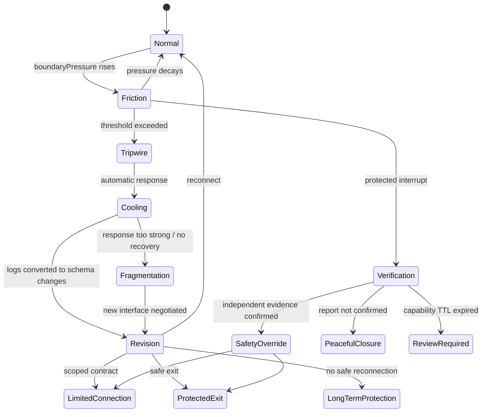

# Aperture P2P Protocol 設計・運用シミュレーション案

## 1. コンセプト

Aperture P2P Protocol は、他者の内面や国家の内部OSを裁定せず、境界・入力・出力・違反時の応答だけを扱うための分散型運用プロトコルである。

家庭内では `Aperture Home` として、家族を小さな主権ノードとして扱う。国際秩序では `P2P Sovereignty Mesh` として、小国・企業・都市・重要インフラを相互接続されたノードとして扱う。

共通原理は以下である。

- **内面不可侵**: ノードの感情、思想、政治体制、動機を直接変更しようとしない。
- **境界可観測**: 外部に出た行動、契約、アクセス、供給、騒音、資源移動だけを観測する。
- **応答自動化**: 境界侵害が閾値を超えたとき、道徳的裁判ではなく事前合意された応答を発火する。
- **選択肢幅の保護**: 接続数そのものではなく、安全で可逆的な接続オプションを増やし、支配的・搾取的・不可逆的な接続を減らす。
- **Trust Minimization**: 信頼、愛、善意、道徳的一致を接続の必須条件にせず、裏切りや故障が起きても被害が限定されるようにする。
- **自動化の非正当化**: 自動実行されたこと自体を、公平性や正当性の証明とみなさない。

このプロトコルは信頼や愛を否定しない。それらがなくても最低限動作し、存在すればより豊かな関係を作れる構造を目指す。

```text
Trust Minimization
+ Verifiable Boundaries
+ Limited Escrow
+ Independent Oracles
+ Reversible Tripwires
+ Protocol Constitution
+ Safe Exit
+ Alternative Routes
+ Continuous Revision
```

エスクローとTripwireは必要な実装要素だが、それだけで安全や公平を生まない。契約形成時の権力差、Oracleの独立性、担保の適格性、応答の可逆性、実質的な退出先を合わせて評価する。

Apertureにおける革命は、エスクローとTripwireを新しい運営者へ移すことではない。中央が独占してきた機能を分離し、再統合を困難にすることである。

```text
Rule-making / Oracle / Custody / Enforcement / Appeal / Exit Routing
```

これらを一主体が同時に支配する場合、その仕組みは分散型を名乗っていても `Protocol Capture` 状態にある。各機能は交換可能な複数providerとして実装し、権限へscopeとTTLを付け、独立した異議経路とFork後の代替接続を維持する。

```text
支配者を交換しただけなら革命ではない。
支配機能を再統合できなくして初めて、ノード化が成立する。
```

## 2. レイヤー構造

### L0: Node Sovereignty

各ノードは内部OSを持つ。家庭なら個人、国際関係なら国家や都市である。

プロトコルは内部OSへ書き込みを行わない。扱うのは公開インターフェースだけである。

### L0.5: Protocol Constitution

通常の Revision では変更できない基本権を定義する。多数決や Guardian の判断も、この層を越えられない。

- SOS と Safe Channel を閉じてはならない。
- 退出・避難・異議申し立てを罰してはならない。
- 当事者の基本権を本人抜きで縮小してはならない。
- 証拠削除や申告撤回を再接続条件にしてはならない。
- 安全保護を資産、接続貢献度、家族内地位、国力に連動させてはならない。

Constitution 自体の変更には、通常 Revision より高い定足数、影響を受ける弱いノードの拒否権、複数メッシュによる公開監査、長い遅延期間を要求する。

### L1: Interface Contract

ノード間の接続条件をAPI契約として定義する。

- 入力: 依頼、資源、アクセス、データ、発言、物理接近
- 出力: タスク完了、対価、応答、供給、アクセス権
- SLA: 期限、品質、上限、停止条件
- Boundary: 侵入禁止領域、音量、時間帯、軍事境界、サプライチェーン条件

家庭例:

```text
executeGarbageDisposal(payload, deadline) -> householdCredit
```

国際例:

```text
maintainTransitCorridor(borderIntegrity, sensorFeed) -> escrowRelease
```

### L2: Tripwire & Cooling

違反が検出された瞬間に、まず通信やアクセスを絞る。ここでは誰が正しいかを決めない。

家庭例:

- 声量や反復割り込みが閾値を超える
- 30分間の Cooling Phase
- 個室・チャット・通知の一時遮断
- Monku Pool へ未処理感情を退避

国際例:

- 国境侵害、港湾封鎖、サイバー侵入、契約供給停止を検出
- エスクロー凍結
- サプライチェーンの自動迂回
- 保険料率・決済信用・物流優先度の即時変更

### L3: Reconstitution

冷却後に、蓄積されたMonkuや違反ログを契約更新案へ変換する。

重要なのは、怒りを消すことではなく、怒りが示した「インターフェースの設計不良」を取り出すことである。

### L4: Safety Override

虐待、暴力、性的被害、ネグレクト、監禁、脅迫、侵略、核使用など、通常の契約更新では扱えない重大な境界侵害は Safety Override として処理する。

Safety Override は「契約違反の調停」ではなく、プロトコル全体の停止条件である。弱いノードの安全は当事者間合意より上位に置かれる。

家庭例:

- 子供のSOSは判決ではなく、保護された割り込みとして扱う。
- 親が加害ノードになり得る場合、親は Guardian Node ではなく監査対象ノードになる。
- 外部 Guardian Node は学校、親族、医師、児童相談所、地域支援機関、警察など家庭外に置く。

国際例:

- 重大侵略や大量破壊兵器使用は、通常のエスクロー調整を超える Safety Override とする。
- ただし応答はネットワーク全体の破壊ではなく、違反主体の接続権・信用・担保・自由度の剥奪を優先する。

## 3. 運用フロー

1. **Normal Phase**
   ノードは通常どおり接続される。契約は可視化され、SLAと境界値だけが監視される。

2. **Friction Phase**
   小さな摩擦が発生する。まだ介入しない。Monku Pool に低強度の信号として蓄積される。

3. **Tripwire Phase**
   摩擦が閾値を超える。プロトコルは裁定ではなく遮断を行う。

4. **Cooling Phase**
   一定時間、通信量・アクセス権・供給経路が制限される。ノードの面子や信念には触れない。

5. **Revision Phase**
   ログから「新しい契約スキーマ」「閾値変更」「代替経路」「報酬配分」を提案する。

6. **Reconnection Phase**
   更新された契約で再接続する。謝罪や思想一致は必須条件ではない。

7. **Safety Override Phase**
   弱いノードへの重大な危害が疑われる場合は、Revision Phase を飛ばして外部 Guardian Node へ接続する。申告は有罪判定ではなく、安全確認プロトコルの開始として扱う。

## 4. 契約更新ガバナンス

契約は単独の誰かが書き換えない。違反ログから生成された差分案を、影響を受けるノードが承認し、安全監査ノードが拒否権を持ったうえで、バージョン更新する。

```text
violation-log -> schema-diff -> affected-node approval -> safety veto check -> contract version bump
```

役割は以下のように分ける。

- **Tripwire**: 違反を検知して接続を止める。裁定はしない。
- **Reconstitution Engine**: ログから契約差分案を生成する。誰が悪いかではなく、どの入力・出力・期限・境界が曖昧だったかを見る。
- **Affected Nodes**: 契約に直接影響を受けるノード。新しい条件に同意するかだけを判断する。
- **External Guardian Node**: 弱いノード、子供、被害者、小国などの安全を監査する外部ノード。不公平・強制・報復・危険な再接続を拒否できる。
- **Protocol Runtime**: 承認された差分だけをマージし、契約バージョンを上げる。

子供のSOSや通報は、加害認定ではなく保護された割り込みである。

```text
Child SOS is not a verdict.
Child SOS is a protected interrupt.
```

### Inter-Mesh Safety Bridge

外部 Guardian を単一の中央機関にしないため、Guardian 機能は別メッシュとの限定接続として実装する。

```text
Family Mesh
  Node-01 / Node-02 / ... / Node-N  (N >= 2)
  Task API / Monku Pool / Revision
        |
        | Safety Bridge
        v
External Safety Mesh
  School Node / Doctor Node / Relative Node
  Local Support Node / Legal Aid Node / Child Welfare Node
```

Safety Bridge は、家庭メッシュの内部OSや通常契約を外部へ開放する扉ではない。Safety Override 時だけ、限定された安全APIを開く。

```text
requestSafetyCheck()
openSafeChannel()
preserveEvidence()
requestTemporaryShelter()
vetoUnsafeReconnection()
```

外部安全メッシュができないことも明示する。

```text
cannotRewriteFamilyRules()
cannotAssignMoralGuilt()
cannotMonitorNormalLife()
cannotMergeRevision()
cannotOverrideEveryContract()
```

これにより Guardian は主権者ではなく、複数ノードによる安全確認機能になる。家庭の自治は残しつつ、弱いノードが密室に閉じ込められることを防ぐ。

#### Capability Lease

Safety Bridge の権限は恒久的な接続ではなく、失効する Capability Lease として発行する。

```text
scope: safety-check | safe-channel | evidence-preservation | temporary-shelter
purpose: incident-id にひもづく単一目的
ttl: 自動失効までの時間または step 数
evidence: 開通根拠と確度
review: 継続時の再承認ノード
appeal: 当事者が利用できる低速の異議チャネル
```

TTL 満了後の継続アクセスは自動更新しない。新しい根拠と独立した再承認を必要とする。

#### Independent Oracle Set

境界侵害を知る仕組み自体を `Oracle Set` として分離する。重要なのは情報源の数ではなく、支配関係、資金、データ基盤、指揮系統が独立していることである。

```text
source-count != source-independence
three reports controlled by one authority = one effective source
```

各ソースには `independence`、`conflictOfInterest`、`tamperResistance`、`provenance` を記録する。強い制限は証拠確度だけでなく、独立性の閾値も満たした後に発火する。

## 5. シミュレーションモデル

### 主要変数

- `boundaryPressure`: 境界への圧力。家庭なら口論の熱量、国際なら侵略・封鎖・強制外交の圧力。
- `trust`: ノード間の接続信頼度。違反や過剰制裁で低下し、安定運用で回復する。
- `entropy`: 未処理Monkuや外部性の蓄積量。
- `tripwireStrength`: 自動応答の強度。高いほど抑止力は増すが、誤作動時のコストも増える。
- `coolingCapacity`: 遮断後に再接続へ戻す能力。家庭なら休息・対話・契約更新、国際なら仲裁・代替物流・保険補填。
- `apertureWidth`: 安全な選択肢の幅。接続数ではなく、退出可能で監査可能な代替経路の多さを表す。
- `meshRedundancy`: 代替接続の多さ。国際シナリオでは小国の生存率を大きく左右する。ただし、支配的・不可逆的な接続は冗長性ではなくリスクとして扱う。
- `guardianCoverage`: 外部 Guardian Node に到達できる確率。家庭では子供の安全、国際では小国の保護に直結する。
- `falseReportCost`: 通報や検知が誤りだった場合の確認コスト。SOS自体を止める理由にはせず、強い制裁を確認後に遅延させる設計に使う。

### 状態遷移



再接続は唯一の成功状態ではない。`LimitedConnection`、`ProtectedExit`、`LongTermProtection` も、強制のない安全状態であれば正常終了として評価する。

## 6. 評価指標

家庭版では、以下を見る。

- 口論の総時間
- 冷却後の再接続率
- Monku Pool から契約更新へ変換された比率
- 家族ノードごとの負荷偏り
- 「誰が悪いか」発話の減少率
- 子供や弱いノードの Safe Channel 到達率
- 通報から外部確認までの時間
- 危険な接続権の剥奪率
- 安全で可逆的な接続オプションの増加量
- Oracle Set の実効独立性
- Safety Bridge の目的外利用時間
- 誤介入率と見逃し率
- 保護された退出の成功率
- Protocol Constitution による越権拒否率

国際版では、以下を見る。

- 小国ノードの生存率
- 侵略側の累積コスト
- サプライチェーン復旧時間
- 誤検知による損失
- メッシュ全体の安全な選択肢幅
- 危険な依存接続の減少率
- 違反主体の接続権・信用・担保・自由度の剥奪量
- 外部安全メッシュ間の相関・共謀リスク
- Capability Lease の期限超過率

## 7. 実装イメージ

最初のプロトタイプは、家庭版と国際版を同じエンジンで動かす。

- 家庭版: ノードは家族メンバー。摩擦は声量、未完了タスク、境界侵害で上昇する。
- 国際版: ノードは小国・資源・港湾・金融エスクロー。摩擦は侵略圧力や供給遮断で上昇する。

同じパラメータを使うことで、「家庭の冷却プロトコル」と「小国連合の自動抑止」が、構造的には同一であることを示す。

現在のプロトタイプでは、通常摩擦、重大 SOS、誤報を別イベントとして投入する。`観測源の独立性`、`憲法層の強度`、`Safety Bridge TTL` を変更し、同じ申告が次のどの出口へ到達するかを比較する。

```text
Reconnection / Limited Connection / Protected Exit / Peaceful Closure
Protocol Capture / Review Required
```

次段階では2人以上の任意数の家庭ノードを独立エージェントとして実装し、権力、退出能力、虚偽率、証拠アクセス、共謀関係を個別に持たせる。単純多数決、中央 Guardian、Safety Bridge、Constitution 付き Safety Bridge を同一シナリオで反復比較する。

## 8. インセンティブ設計

接続が増えることは、必ずしも有利ではない。悪い接続はノイズ、搾取、監視、依存、巻き込まれリスクを増やす。

したがって、報酬と罰は「接続数」ではなく「接続の質」にかける。

- **プラスインセンティブ**: 安全な退避先、匿名性、報復防止、心理的支援、生活・教育・医療の継続、保護ログの保全、安全な代替経路の追加。
- **マイナスインセンティブ**: 支配的・搾取的・不可逆的な接続権の停止、監督権限の剥奪、担保没収、信用低下、アクセス制限、外部監督下での再接続。

担保にできる対象は、喪失しても生存、基本権、安全経路を壊さない限定資産またはCapabilityに限る。住居、食事、医療、教育、基礎通信、SOS経路、本人の私物をエスクローや制裁対象にしない。

家庭では共有設備の予約枠、任意の家事交換優先権、契約の一時凍結など、可逆的なCapabilityを用いる。国家間ではエスクロー、保険、決済、物流、供給枠を利用できるが、違反に使用された接続能力へ対象を限定し、住民全体の生活破壊へ拡張しない。

家庭では、虐待確認後に破壊されるべきなのは家族という名前ではなく、加害者が子供へ無制限にアクセスできる危険な接続形態である。

国際関係では、重大違反に対する理想的な応答は核兵器のような全面破壊ではなく、違反主体に限定された外科的な接続遮断である。

```text
虐待・侵略・境界侵害をすると、支配できる接続が減る。
通報・検知・保護に協力すると、安全な接続が増える。
```

## 9. 設計上の注意

### 誤作動耐性

トリップワイヤーは強いほど危険でもある。単一センサーでは発火させず、複数ソースの合意、遅延窓、異議申し立て用の低速チャネルを用意する。

複数ソースが同じ指揮系統に属する場合は1ソースとして数える。証拠確度と観測源独立性を別の変数として管理する。

### 過剰制裁の回避

自動応答は「破壊」ではなく「一時停止」「担保凍結」「優先度変更」から始める。不可逆な物理破壊は最終層に置く。

通報やSOSは止めない。ただし、加害側への強い制裁は、外部 Guardian Node による安全確認後に実行する。通報は有罪判定ではなく、確認プロトコルの開始である。

### 人間味の維持

家庭版では、プロトコルの言葉が冷たくなりすぎる危険がある。表示上は「制裁」ではなく「呼吸を整える」「再接続の準備」「境界の再調整」として扱う。

### 主権の尊重

国際版では、内部体制を裁かないことと、外部被害を放置することは別である。人権侵害や難民流出は、内政への説教ではなく、負の外部性としてエスクロー・物流・保険・市場アクセスに接続する。

### Protocol Capture の監査

境界を守る仕組み自体が新しい侵害者になる可能性を常に評価する。観測源の集中、Guardian 間の共謀、期限切れ権限の継続、Revision による基本権縮小を `protocolCaptureRisk` として可視化する。

```text
プロトコルの成功 = 境界侵害の減少 - 誤介入 - 権力集中 - 退出妨害
```

## 10. 一文での表現

他者の心を支配しない。ただし、境界を越えた入力には、世界が自動的に応答する。

接続数を増やすのではない。安全な選択肢の幅を増やす。

このプロトコルが守るのは関係そのものではなく、各ノードが安全な関係を選び直せる可能性である。
