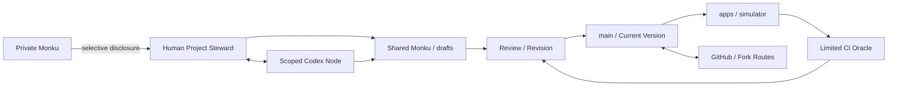

# Aperture Development Mesh

```text
Status: proposal
Implementation: partially practiced, not formally adopted
Last updated: 2026-08-24
Origin: Aperture Mesh Protocolを開発するWorkspace運用についての対話
```

## 1. Purpose

このリポジトリを、Aperture Mesh Protocolについて記述する保管庫としてだけでなく、Aperture方式でProtocolを開発する `Development Mesh` として運用する。

開発中に生じる違和感、未解決の差異、反例、変更案を消さず、Private MonkuからDraft、Review、Revision、Version Activationへ移す。この循環自体を、Apertureの認識論的アライメント、限定接続、可逆性、監査可能性の実験とする。

これは「Gitを使えば分散型になる」という主張ではない。GitとWorkspaceが提供する機能を、Apertureの設計原理に照らして意識的に運用し、対応しない部分と権力集中も記録する提案である。

---

## 2. Workspace Topology

現在のDevelopment Meshには、少なくとも次の役割がある。

```text
Human Project Steward
  目的、価値判断、外部への責任、公開判断を担う

Codex Execution Node
  指定された範囲で調査、提案、編集、検証を行う

Repository
  現在のProtocol Version、Draft、実装、履歴を保持する

GitHub Remote
  共有、複製、レビュー、Forkのための外部接続点

CI Oracle
  定義済みの機械的検査だけを実行する
```

Codexは、人間と同じ権利、責任、継続的記憶を持つ対等な人格Nodeではない。タスク、Workspace、権限、実行時間によってscopeされた一時的な実行Nodeである。新しいCodexタスクへの継続性は会話上の同一性ではなく、リポジトリに残された状態と履歴によって作る。

CIも真実、公平、安全を認定するOracleではない。構文、型、テスト、ビルドなど、事前定義された狭い命題だけを検証する。



---

## 3. Monku Lifecycle

```text
Private Monku
  -> Shared Monku
  -> Draft / Hold
  -> Review
  -> Revision Proposal
  -> Version Activation or Rejection
  -> Simulation / Implementation
  -> Observation
  -> new Monku
```

### Private Monku

個人的、未整理、機密、またはまだ共有したくない違和感。リポジトリへ保存しない。

ローカルリポジトリに置いた情報も、commit、backup、同期、画面共有などで漏れる可能性がある。`drafts/`はPrivate領域ではない。

### Shared Monku

本人がWorkspaceへ提出することを選んだ問題提起。原文をそのまま公開する必要はなく、必要最小限の問題、境界、観測、希望する変更へ変換できる。

### Draft / Hold

既存のProtocol Versionへまだ統合しない状態。未完成、異議、反例、代案、未決事項を保持する。

Draftは採用待ちの下位文書ではない。現行Schemaでは処理できない残余を保持し、拙速な収束を防ぐ認識論的バッファである。

### Review / Revision Proposal

影響を受ける範囲、Constitutionとの整合、反例、安全性、実装コスト、却下した代案を確認する。AIは差分、反例、テストを提案できるが、自己判断だけで採用を確定しない。

### Version Activation

合意されたRevisionを現在の正本へ反映する。文書なら `docs/`、運用規約なら `CONTRIBUTING.md`、実験なら `simulator/`、実装なら `apps/` が候補になる。

### Observation

利用、テスト、批判、失敗から新しいMonkuを得る。Version Activationを終点にせず、次のRevisionへ戻す。

---

## 4. Repository Mapping

```text
Private Monku       リポジトリ外。本人が共有を選ぶまで保持する
Shared Monku        Issue、対話から構造化された問題提起
drafts/             Hold、仮説、反例、設計候補、未決事項
docs/               現時点で採用されたProtocol Version
apps/               実行可能なDomain Profileと体験実験
simulator/          状態遷移、失敗モード、仮説の検証環境
tests / CI          限定された機械的Invariantの検査
git history         Revisionと判断結果の監査履歴
```

`docs/`も永久不変の真理ではない。現在採用されているVersionであり、新しい証拠、反例、MonkuによってRevisionできる。

---

## 5. Git Operation Mapping

| Git / Workspace操作 | Aperture上の役割 | 対応の限界 |
| --- | --- | --- |
| Issue / Shared Monku | 違和感の提出 | 公開IssueへPrivate情報を置かない |
| Draft | 未解決状態の保持 | 保存しただけでは検証済みにならない |
| Branch | 本流を変更しない限定実験 | セキュリティ境界や完全な主権ではない |
| Diff | Revisionの変更内容 | 意図、影響、欠落までは自動表示しない |
| Review | 異議、反例、影響範囲の確認 | Reviewerの独立性はGitだけでは保証されない |
| Commit | 状態の固定と履歴化 | 内容の正しさや合意を保証しない |
| Merge | Version Activation | 権限者一人のmergeは分散合意ではない |
| Revert | 可逆的な復旧手段 | 外部で起きた損害までは巻き戻せない |
| Fork | Exitと別経路での再構成 | 資金、利用者、インフラの可搬性は別途必要 |
| CI | 限定Oracle | 定義されていない社会的失敗は検知できない |

この対応表を、Git操作の美化に使わない。例えば、履歴が残っていてもmerge権限、ホスティング、資金、秘密情報が一主体へ集中していれば、Development MeshはProtocol Capture状態になり得る。

---

## 6. Draft Contract

新しいDraftには、可能な範囲で次を含める。

```text
Status
Origin
Problem / Monku
Proposal
Affected Areas
Constitution Check
Counterexamples
Unresolved Risks
Decisions Needed
Promotion Gate
Rejected Alternatives
Last Updated
```

すべての初期Monkuへ完全なSchemaを要求しない。未整理の問題提起を受け取った後、人間またはCodexが原意を奪わない範囲で構造化する。

却下されたDraftは、理由を記録して `rejected` にする。履歴から消さないことで、同じ案の反復と、少数意見の不可視化を防ぐ。

別の設計に置き換わった場合は `superseded` とし、後継文書への参照を付ける。

---

## 7. Decision and Authority Boundary

現在のDevelopment Meshは完全に分散化されていない。GitHubリポジトリの所有、公開、merge、外部責任はHuman Project Stewardへ集中している。この非対称性を隠さず、実験上の現在条件として扱う。

### Human Project Steward

- 目的、優先順位、公開範囲、価値判断を決める。
- Private Monkuを共有するか選ぶ。
- 外部へ影響する行為と最終的な採用に責任を持つ。
- AI提案を拒否、保留、Revisionできる。

### Codex Execution Node

- 既存文書とコードを読み、提案、反例、差分、テストを作る。
- 作業前にscopeを確認し、既存の未関連変更を破壊しない。
- 不確実性、安全上の限界、未検証事項を明示する。
- Draftを自動的に真実または正式仕様として扱わない。
- 人間の明示的判断なしに、Protocol Constitutionを縮小しない。

### CI Oracle

- 指定された検査を再現可能に実行する。
- 通過した命題と、検査していない命題を区別する。
- CI成功を公平性、安全性、社会的有効性の証明として扱わない。

---

## 8. Proposed Working Protocol

### Low-Risk Change

誤字、リンク、既存判断を変えない小さな保守変更は、直接Revisionとして提案できる。テストとdiffを確認し、履歴を残す。

### New Idea

新しい概念、Domain Profile、権限、Tripwire、データ利用は、まず `drafts/` へ置く。未決事項と安全境界を記録する。

### Promotion

Draftを正式文書または実装へ移すときは、最低限次を満たす。

1. Human Project Stewardが採用範囲を確認する。
2. Constitutionとの矛盾を検査する。
3. 反例、権力集中、失敗モードを記録する。
4. 実装を伴う場合、テストと停止条件を定義する。
5. Draftを `candidate` または `superseded` に更新する。
6. diffと判断理由をcommit履歴へ残す。

### Disagreement

人間とCodex、複数Reviewer、または複数の設計案が収束しない場合、結論を強制しない。

```text
Hold
  keep both alternatives
  record affected assumptions
  define evidence needed
  set review condition
  use a branch or simulator when useful
```

AIが説得力のある文章を生成できることを、合意の証拠にしない。

---

## 9. Capture Audit

Development Meshについて定期的に次を確認する。

- 一人または一つのAIだけがRule、Review、Mergeを実質的に支配していないか。
- Draftが批判を隔離して忘れる場所になっていないか。
- CIで測れるものだけが価値ある意見として残っていないか。
- GitHubへアクセスできない人のMonkuが構造的に排除されていないか。
- Forkできても、知識、資産、実行環境が持ち出せない状態ではないか。
- AIの提案量によって人間の判断時間と認知容量が圧迫されていないか。
- `main`へ入った文章が権威化し、Revision不能になっていないか。
- Private Monkuの共有を、参加または貢献の条件にしていないか。

---

## 10. Decisions Needed

1. Draft branchをローカル限定にする条件と、GitHubへpushする条件は何か。
2. Human Project Stewardの「採用」を、会話、Review、mergeのどこで明示するか。
3. Draftを `candidate` へ変更できる主体と必要なReviewは何か。
4. Issue、Draft文書、Discussionをどのように使い分けるか。
5. 却下されたMonkuを検索可能に保ちながら、個人情報を残さない方法は何か。
6. 外部Contributorが加わった場合、Affected-Node Consentをどう定義するか。
7. Protocol Constitution変更に、通常文書より強いReviewをどう要求するか。

---

## 11. Promotion Target

この運用を数回試し、過剰な手続、取りこぼしたMonku、権限の曖昧さをRevisionした後、次のように昇格する。

- 短い実務規約を `CONTRIBUTING.md` へ統合する。
- 詳細な思想と対応表を `docs/aperture-development-mesh.md` として採用する。
- Draft metadataまたはReview checklistを必要に応じてテンプレート化する。

昇格前に、このDraft自身をDevelopment Meshの最初の運用テストとして扱う。
