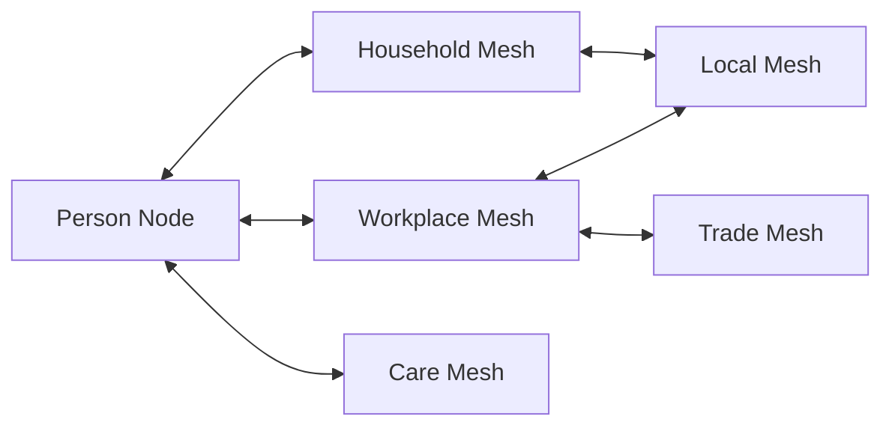

# Aperture Workplace Pilot

```text
Status: proposal
Implementation: not started
Last updated: 2026-08-24
Origin: Aperture Homeの適用範囲に関する設計対話
```

## 1. Proposal

`Aperture Home`を家庭での身体知実験として維持しつつ、小規模事業所を第二の低リスク実験環境として定義する。

事業所では、タスク、役割、期限、設備、責任範囲などのInterface Contractを家庭より明示しやすい。これを利用し、人格や組織への忠誠と、個別の業務接続条件を分離できるか検証する。

このDraftは、雇用管理、人事評価、労務判断、懲戒、内部通報制度を実装する提案ではない。

---

## 2. Topology Hypothesis

Aperture Meshの成長を、次の一本の包含ツリーだけで扱わない。

```text
Household -> Municipality -> State -> World
```

このモデルだけでは、下位単位が上位単位へ吸収される新しいピラミッドを作りやすい。実際のNodeは、家庭、事業所、学校、ケア、地域、協同組合、取引ネットワークなど、目的の異なる複数Meshへ同時に接続する。



小規模事業所を加える意義は、家庭から国家へスケールアップすることではない。異なるMeshへ同時所属するNodeと、Mesh間の限定接続を早期に観察できることである。

---

## 3. Product Boundary

共通プロトコルと利用領域固有のルールを分離する。

```text
Aperture Protocol Core
  Node / Contract / Impact Set / Consent
  Hold / Revision / Cooling / Limited Connection
  Exit / Fork / Audit / Constitution Check

Domain Profiles
  Aperture Home
  Aperture Workplace
  Future Cooperative / Inter-Mesh profiles
```

`Aperture Home`を汎用業務アプリへ改名しない。家庭と事業所では権力差、依存関係、法的義務、許容できるTripwireが異なるため、UI、Constitution、データモデル、実験手順をDomain Profileとして分ける。

初期段階ではコードを共通パッケージへ抽出しない。HomeとWorkplaceの実際の重複が確認されてから、安定したDomainロジックだけをCore候補にする。

---

## 4. What the Pilot Can Test

### W1: Contract Clarity

軽微な業務依頼を、人格、能力、忠誠の評価を含まないContractとして記述すると、期待の曖昧さを減らせるか。

### W2: Refusal Without Retaliation

拒否または期限付きHoldを正式状態にすると、沈黙、過剰な引き受け、非公式な報復を減らせるか。

### W3: Affected-Node Consent

役職や単純多数決ではなく、変更の影響を受けるNode集合から同意条件を計算できるか。

### W4: Bounded Compatibility

全面的な賛否の代わりに、対象、時間、データ、設備、責任を限定した接続を選べるか。

### W5: Role Separation

Rule-maker、Oracle、Enforcement、Appeal、Revision Mergerを経営者または管理者一人へ集中させずに運用できるか。

### W6: Mesh Overlap

一人のNodeが家庭と事業所の両方へ接続しながら、片方の内部データや権限をもう片方へ漏らさずに境界を維持できるか。

### W7: Operational Resilience

一つのNodeまたは経路が停止したとき、人格的な非難や全面停止ではなく、代替経路、限定接続、Revisionで継続できるか。

---

## 5. Workplace Constitution

通常設定、投票、管理者操作、AI提案によって次を変更できない。

```text
WP-C01 参加拒否を採用、給与、人事評価、契約更新へ利用しない
WP-C02 給与、雇用、保険、安全装備、休憩、法定権利をEscrowにしない
WP-C03 Hold、異議、Appeal、Exitを懲戒理由にしない
WP-C04 Private Monkuの原文を上司、同僚、外部AIへ自動送信しない
WP-C05 位置、音声、画面、身体情報を常時監視しない
WP-C06 AIは評価、採否、懲戒、通報、Revision mergeを行わない
WP-C07 Exitを退職と同一視しない
WP-C08 法令、安全基準、労働者保護をプロトコルで迂回しない
WP-C09 経営者を唯一のOracle、Executor、Appeal先にしない
WP-C10 実験データを本人の同意なく生産性評価へ転用しない
```

雇用関係では、形式的な同意があっても実質的に拒否できない可能性がある。参加の任意性はチェックボックスではなく、不参加者が不利益を受けない運用と観測結果によって評価する。

---

## 6. Initial Scope

最初の実験対象は、失敗しても雇用、収入、安全、顧客、法的義務へ重大な影響を与えないものに限定する。

候補:

- 共用備品の補充依頼
- 任意参加の短い社内勉強会
- 会議室または共有スペースの低リスクな利用調整
- 非緊急かつ代替担当を置ける小さな内部タスク
- 匿名化された合成シナリオ上のRevision練習

対象外:

- 勤怠、給与、査定、採用、解雇、懲戒
- ハラスメント、内部通報、労災、安全事故の自動判定
- 顧客データ、営業秘密、医療・福祉・金融情報
- スマートロック、アカウント停止、決済停止の自動執行
- 実在する緊急対応の代替

---

## 7. Proposed Experiment Stages

### Stage W0: Governance Contract

- 参加と撤回を任意にする。
- 不参加による不利益を禁止する。
- データ保持期間、閲覧者、削除手順を決める。
- 実験停止条件と外部相談経路を決める。

Gate: 経営者、管理者、開発者の誰も単独でConstitutionを変更できない。

### Stage W1: Synthetic Simulation

実在の従業員データを使わず、役職、権力差、沈黙、共謀、虚偽、期限切れを含む合成シナリオで状態遷移を検証する。

Gate: 給与、雇用、安全、Appealを侵害する遷移がConstitution検査で拒否される。

### Stage W2: Facilitated Tabletop

架空の事業所と役割を使い、参加者がContract、Hold、Revision、Limited Connection、Exitを操作する。

Gate: 参加者が拒否と人事評価を混同せず、誰が影響を受けるか説明できる。

### Stage W3: Low-Risk Pilot

`N >= 2` の任意人数で、一種類の低リスクな内部調整だけを短期間試す。管理者は観測者であっても、全Nodeの私的入力を閲覧できない。

Gate: 不参加、拒否、撤回、データ削除が実際に不利益なく行える。

### Stage W4: Inter-Mesh Scenario

家庭Meshと事業所Mesh、または二つの事業所Meshの間で、内部情報を公開せずに限定Capabilityを交換する合成実験を行う。

Gate: 一方のMeshが他方の内部Rule、Identity、Private Monkuを要求せずに接続できる。

---

## 8. Metrics

- Contract作成時に人格評価が混入した率
- Holdが暗黙の賛成または拒否へ変換された率
- 拒否、撤回、不参加後に不利益が発生した率
- 影響を受けない役職者が決定を上書きした率
- Limited Connectionで全面対立を回避できた率
- 単一主体へ集中したプロトコル機能数
- PrivateデータのMesh間漏出件数
- 代替経路またはRevisionによる回復率
- アプリ外でも同じ判断様式を使えた率

高い合意率、タスク完了数、生産性向上だけを成功指標にしない。それらは同調圧力、監視、拒否不能によっても上昇する。

---

## 9. Stop Conditions

次のいずれかが発生した場合、実地実験を停止し、データ収集と接続を最小化する。

- 不参加または拒否が人事上の不利益へ使われた。
- Private Monkuまたは個人データが意図しない相手へ開示された。
- 管理者がConstitutionまたは監査履歴を迂回した。
- 実験が実質的な勤怠管理、査定、懲戒へ転用された。
- Appealまたは撤回が機能しない。
- 参加者が監視、報復、雇用不安を感じても安全に申告できない。
- 法務、労務、安全の専門確認が必要な領域へ範囲が広がった。

---

## 10. Decisions Needed

実装前に次を決める。

1. `Aperture Workplace`を独立アプリにするか、Protocol LabのDomain Profileにするか。
2. 最初に検証するContractを一種類に絞ると何か。
3. 事業所内で管理系統から独立したAppeal経路をどう用意するか。
4. 任意参加が実質的に成立したことを、誰がどのように確認するか。
5. HomeとWorkplaceで共有可能な型と、共有してはいけない型は何か。
6. Mesh間実験で公開する最小Capability proofは何か。
7. 労務・プライバシーの専門レビューをどのStageで必須にするか。

---

## 11. Suggested Codex Handoff

次のCodexタスクでは、直ちに業務アプリを実装せず、次の順で進める。

1. このDraftと関連文書の矛盾をレビューする。
2. Stage W1用の合成シナリオを10件以上定義する。
3. Workplace Constitutionを機械判定可能な不変条件へ変換する。
4. Aperture HomeのDomainロジックを調査し、再利用候補と家庭固有部分を分類する。
5. 画面を作る前に、状態遷移と権限分離をテストとして実装する。
6. Decisions Neededを人間と合意した後、最小のTabletop Prototypeを提案する。

最初の成果物は、本番利用可能な職場管理アプリではなく、合成データだけで権力差と失敗モードを検証できるProtocol Labとする。
